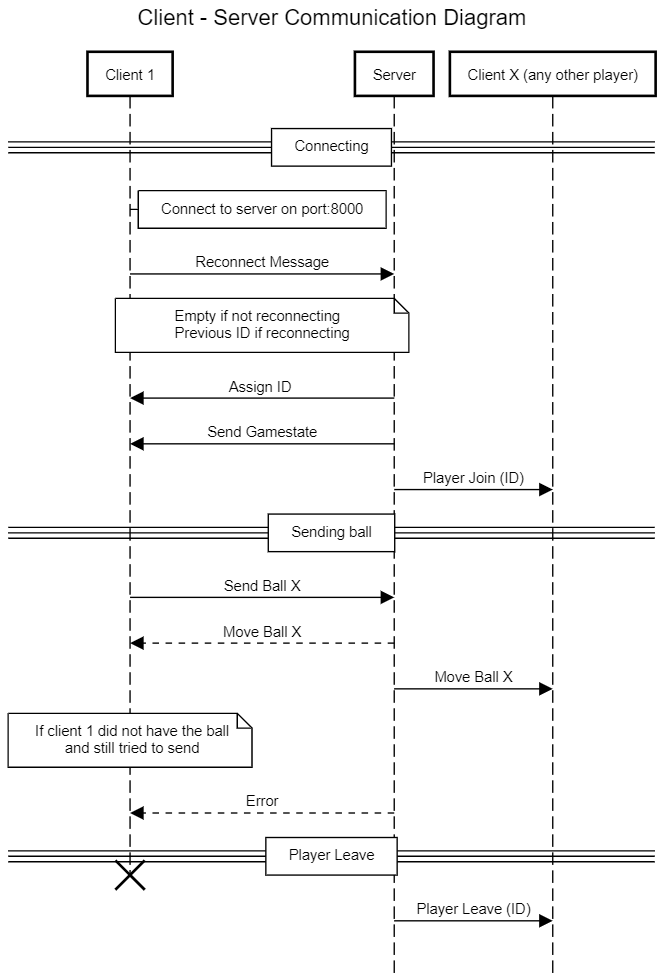

# ClientServerApplications
Work for Advanced Programming assignment, using both Java and C# supporting the same protocol over Sockets.

## Protocol
This is a client-server application where the client initiates a connection to the server. 
The protocol is text based and includes commands and parameters and both the client and server can initiate communication.
Client commands sent to server
Command	Parameters
SEND_BALL <ID>	Where ID is the player the user is sending the ball to
REJOIN <ID>	Sent when reconnecting to the server

Client commands sent to server
|    Command           |    Parameters                                                  |
|----------------------|----------------------------------------------------------------|
|    SEND_BALL <ID>    |    Where ID is the   player the user is sending the ball to    |
|    REJOIN <ID>       |    Sent when   reconnecting to the server                      |

Server commands sent to client
|    Command                     |    Parameters                                                                                                                                                                          |
|--------------------------------|----------------------------------------------------------------------------------------------------------------------------------------------------------------------------------------|
|    ASSIGN_ID <ID>              |    This will be sent   back after the player connects to the server. The reply is the users assigned   ID.                                                                             |
|    SEND_GAMESTATE   <1> <2>    |    1. The list of   connected players (including this client). Player ID’s split by commas   2. ID of the player   that has the ball.       Example:   “SEND_GAMESTATE 1,2,3,4,5 4”    |
|    SEND_BALL <ID>              |    ID is player getting   ball                                                                                                                                                         |
|    PLAYER_JOIN   <ID>          |    ID is the new   players ID                                                                                                                                                          |
|    PLAYER_LEAVE   <ID>         |    The leaving player’s   ID                                                                                                                                                           |
|    ERROR   <Message>           |    If an error occurs   at any time, this message will be sent to the client specifying the error.                                                                                     |

**Communication Diagram**

# GIF
Here is a GIF showing that how the application works, and that clients can recover after server disconnection by hosting their own server, with other clients reconnecting.

